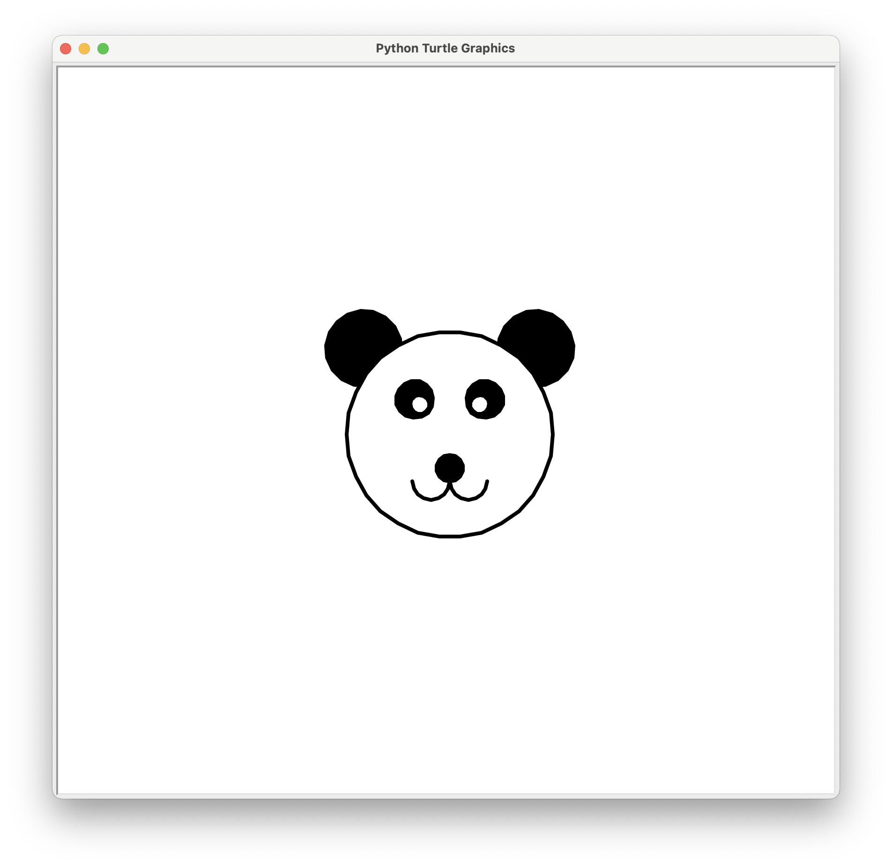
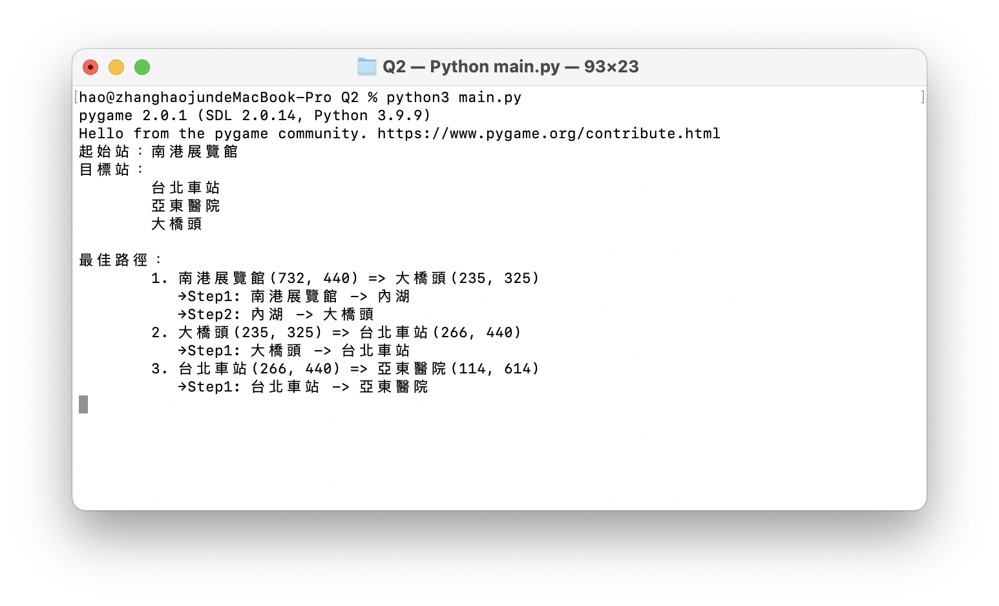
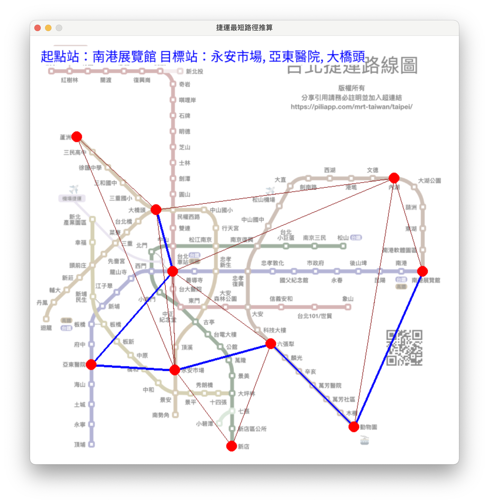
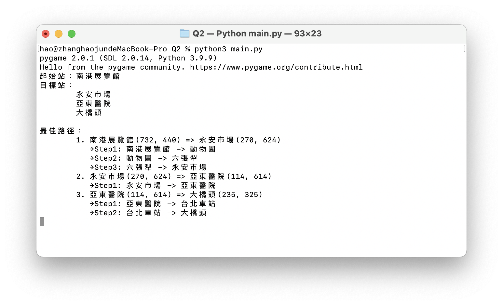
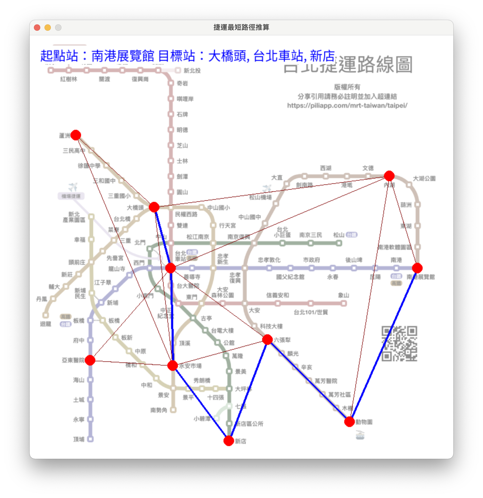
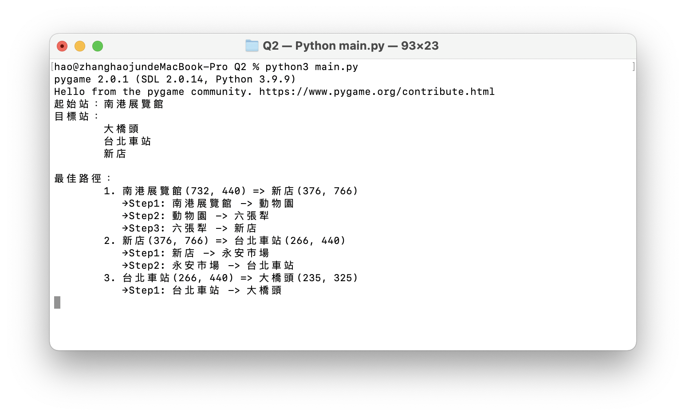

# Python期末專題報告

By 張皓鈞 B11030202

2022/01/04


## FIG1 Q1

嘗試修改基於Turtle的臉部繪圖程式

使其可以繪製熊貓的臉部圖案

### 解題思路

因範例提供的Face Class已經有定義好的臉部繪製方法，故我選擇邊寫新的Panda Class來繼承Face Class，並透過複載(override)將繪製的方法進行修改，使其可以繪製熊貓臉部圖案

### 程式

#### main.py

```python
from turtle import *
from Panda import Panda

# sets the animation speed: can be 'slow'
speed('slow')

# uncomment for instanteneous drawing - no animation
# tracer(0)

p = Panda(0, 0)
p.setSize(110)
p.draw()

# Uncomments to show drawing if no animation
# update()

hideturtle()
done()
```

#### Panda.py

```python
from turtle import *
from Face import Face

class Panda(Face):

    def __init__(self, xpos, ypos):
        super().__init__(xpos, ypos)

    def draw(self):
        self.goHome()
        pensize(4)
        self.drawEars()
        self.drawOutline()
        self.drawEyes()
        self.drawNose()
        self.drawMouth()

    def drawEars(self):
        radius = self._size * 0.3636

        # Draw first ear
        left(45)
        forward(self._size - radius * 0.5)
        right(90)
        pendown()
        Face.ring('black', radius)
        penup()
        self.goHome()
        
        # Draw second ear
        left(45 + 90)
        forward(self._size - radius * 0.5)
        right(90)
        pendown()
        Face.ring('black', radius)
        penup()
        self.goHome()

    def drawOutline(self):
        forward(self._size)
        left(90)
        pendown()
        Face.ring('white', self._size)
        penup()
        self.goHome()

    def drawEyes(self):
        ##### Draw eyes black #####
        
        # Draw first eye
        penup()
        left(45)
        forward(self._size * 0.3)
        right(90)
        pendown()
        Face.ring('black', self._size * 0.1818)
        self.goHome()
        
        # Draw second eye
        penup()
        left(45 + 90)
        forward(self._size * 0.3)
        right(90)
        pendown()
        Face.ring('black', self._size * 0.1818)
        self.goHome()
        
        ##### Draw eyes white #####
        
        # Draw first eye
        penup()
        left(45)
        forward(self._size * 0.32)
        right(90)
        pendown()
        Face.ring('white', self._size * 0.0909)
        self.goHome()
        
        # Draw second eye
        penup()
        left(45 + 90)
        forward(self._size * 0.32)
        right(90)
        pendown()
        Face.ring('white', self._size * 0.0909)
        self.goHome()

    def drawNose(self):
        penup()
        right(90)
        forward(self._size * 0.2)
        right(90)
        pendown()
        Face.ring('black', self._size * 0.1272)
        self.goHome()

    def drawMouth(self):
        penup()
        right(90)
        forward(self._size * 0.2 + (self._size * 0.1272) * 2)
        pendown()
        circle(self._size * 0.1818, 180)
        penup()
        self.goHome()
        right(90)
        forward(self._size * 0.2 + (self._size * 0.1272) * 2)
        pendown()
        left(180)
        circle(self._size * 0.1818, -180)
        self.goHome()
```

#### Face.py

```python
from turtle import *

# A function is defined for each part, with following steps
#    1. pen up
#    2. move to correct position
#    3. pen down
#    4. draw
#    5. return home

class Face:

    def __init__(self, xpos, ypos):
        self._size = 50
        self._coord = (xpos, ypos)
        self._noseSize = 'normal'

    def setSize(self, radius):
        self._size = radius
        
    def draw(self):
        self.goHome()
        pensize(2)
        self.drawOutline()
        self.drawEye(135)
        self.drawEye(45)
        self.drawMouth()
        self.drawNose()
        pensize(5)
        self.drawHairStrand(-15, -17)
        self.drawHairStrand(0, -17)
        self.drawHairStrand(15, -17)
        self.drawHairStrand(165, 17)
        self.drawHairStrand(180, 17)
        self.drawHairStrand(195, 17)

# --------------------------------------------------
#    Functions that are called from with the class
# --------------------------------------------------


    # After drawing each part, turtle position 
    # returns to centre. Parts can be drawn in any order
    def goHome(self):
        penup()
        goto(self._coord)
        setheading(0)
        
    def drawOutline(self):
        penup()
        forward(self._size)
        left(90)
        pendown()
        circle(self._size)
        self.goHome()

    def drawEye(self, turn):
        penup()
        left(turn)
        forward(self._size / 2)
        pendown()
        dot(self._size/10)
        self.goHome()
        
    def drawMouth(self):
        penup()
        right(135)
        forward(self._size/1.7)
        left(90)
        pendown()
        circle(self._size/1.7, 90)
        self.goHome()

    def drawNose(self):
        if self._noseSize == 'large' :
            dot(self._size/2, "grey")
        elif self._noseSize == 'small' :
            dot(self._size/6, "grey")
        else :
            dot(self._size/4, "grey")
        self.goHome()
        

    def drawHairStrand(self, headAngle, headAngleIncrement):
        penup()
        setheading(90)
        forward(self._size)
        pendown()
        segmentLength = int(self._size/6)
        for i in range(5):
            setheading(headAngle)
            headAngle += headAngleIncrement
            forward(segmentLength)
        self.goHome()

    @staticmethod
    def ring(col: str, rad: int):
        """
        Draw a colored circle with a dynamic radius

        Args:
            col (str): Color
            rad (int): Radius
        """
        # Set the fill
        fillcolor(col)
    
        # Start filling the color
        begin_fill()

        # Draw a circle
        circle(rad)
    
        # Ending the filling of the color
        end_fill()
```

### 效果展示



## FIG1 Q2

編寫一個計算捷運車站從起始車站到多個目標車站最佳路徑的GUI程式

### 解題思路

利用物件導向設計原則，編寫/設計MRT.Station、MRT.Path、MRT.GUI Classes，將系統拆分為車站、路徑、介面的不同類，其中的最佳路徑計算採用*Dijkstra演算法*

### 程式

#### main.py

```python
import math
import random
import MRT

# 定義車站資訊
stations_info = {
    "南港展覽館": {
        "pos": (732, 440),
        "nearby": [
            "內湖", "動物園"
        ]
    },
    "內湖": {
        "pos": (679, 266),
        "nearby": [
            "南港展覽館", "動物園", "台北車站", "大橋頭"
        ]
    },
    "動物園": {
        "pos": (604, 730),
        "nearby": [
            "南港展覽館", "內湖", "六張犁"
        ]
    },
    "六張犁": {
        "pos": (449, 575),
        "nearby": [
            "新店", "永安市場", "台北車站"
        ]
    },
    "台北車站": {
        "pos": (266, 440),
        "nearby": [
            "內湖", "大橋頭", "亞東醫院", "永安市場", "六張犁"
        ]
    },
    "大橋頭": {
        "pos": (235, 325),
        "nearby": [
            "內湖", "蘆洲", "永安市場", "台北車站"
        ]
    },
    "永安市場": {
        "pos": (270, 624),
        "nearby": [
            "六張犁", "台北車站", "大橋頭", "蘆洲", "亞東醫院", "新店"
        ]
    },
    "蘆洲": {
        "pos": (87, 189),
        "nearby": [
            "大橋頭", "永安市場"
        ]
    },
    "亞東醫院": {
        "pos": (114, 614),
        "nearby": [
            "台北車站", "永安市場"
        ]
    },
    "新店": {
        "pos": (376, 766),
        "nearby": [
            "六張犁", "永安市場"
        ]
    }
}

def getRandomStations(stations: list[MRT.Station], number = 3) -> list[MRT.Station]:
    """
    隨機獲取多個目標車站(不重複)

    Args:
        stations (list[MRT.Station]): 車站列表
        number (int, optional): 數量 Defaults to 3.

    Returns:
        list[MRT.Station]: 隨機選出的車站
    """
    shuffle_stations = stations.copy()
    random.shuffle(shuffle_stations)
    return shuffle_stations[0:number]

if __name__ == "__main__":

    # 創建車站物件
    stations = [MRT.Station(name, info['pos'], info['nearby']) for name, info in stations_info.items()]

    # 宣告MRT相關物件
    gui = MRT.GUI()
    path = MRT.Path(stations)

    # 設置起點站
    start_station = stations[0]

    # 刪除起點站，以避免被抽中作為目標站
    stations_without_start = stations.copy()
    del stations_without_start[stations_without_start.index(start_station)]
    # 隨機抽出目標站
    target_stations = getRandomStations(stations_without_start)

    # 印出起點站和目標站相關資訊
    print("起始站：{}".format(start_station.name))
    print("目標站：")
    for station in target_stations:
        print("\t{}".format(station.name))

    # 繪製所有車站的可能路徑
    gui.drawStationsWay(stations)

    # 計算所有目標車站的最佳路徑並繪製
    print("\n最佳路徑：")
    begin_station = start_station
    target_stations_copy = target_stations.copy()
    for i in range(len(target_stations_copy)):
        # 從剩餘目標車站中挑出最近的一個先走
        min_dis = math.inf
        min_station = begin_station
        min_shortest_path = None
        for station in target_stations_copy:
            dis = 0
            # print("begin: {}, target: {}".format(begin_station.name, station.name))
            shortest_path = path.findShortestPath(begin_station, station)
            for p in shortest_path:
                dis += p['distance']
            if dis < min_dis:
                min_dis = dis
                min_station = station
                min_shortest_path = shortest_path
        # 從列表中刪除已到達的車站
        del target_stations_copy[target_stations_copy.index(min_station)]
        print("\t{}. {} => {}".format(i + 1, begin_station, min_station))
        for j in range(len(min_shortest_path) - 1):
            print("\t   →Step{}: {} -> {}".format(j + 1, min_shortest_path[j]['name'], min_shortest_path[j + 1]['name']))
        # 繪製從起點到終點的路徑
        gui.drawStationsPath(path, min_shortest_path)
        begin_station = min_station

    # 繪製所有車站的標記點
    gui.drawStationsPoint(stations)

    # 在圖上印出路徑相關資訊
    target_stations_text = ""
    i = 0
    for station in target_stations:
        target_stations_text += station.name + (", " if i != len(target_stations) - 1 else "")
        i += 1
    gui.drawInfoText("起點站：{} 目標站：{}".format(start_station.name, target_stations_text))

    # 等待視窗關閉
    gui.waitClose()
```

#### Station Class

```python
class Station:
    """
    車站
    """

    def __init__(self, name: str, pos: tuple, nearby = []):
        """
        車站

        Args:
            name (str): 站名
            pos (tuple): 座標
            nearby (list[str], optional): 鄰近車站名稱
        """
        self._name = name
        self._pos = pos
        self._nearby = nearby

    def __str__(self):
        return "{}({}, {})".format(self._name, self._pos[0], self._pos[1])

    @property
    def name(self) -> str:
        """
        車站名稱

        Returns:
            str: 車站名稱
        """
        return self._name

    @property
    def pos(self) -> tuple:
        """
        車站座標

        Returns:
            tuple: 車站座標 格式：(x, y)
        """
        return self._pos

    @property
    def nearby(self) -> list[str]:
        """
        相鄰車站名稱

        Returns:
            list[str]: 相鄰車站名稱
        """
        return self._nearby
```

#### Path Class

```python
class Path:
    """
    路徑
    """

    def __init__(self, stations: list[Station]):
        """
        路徑

        Args:
            stations (list[Station]): 車站列表
        """
        self._stations = stations

    @staticmethod
    def _minDistance(distances: dict) -> tuple:
        """
        找出列表中尚未marked的最近車站

        Args:
            distances (dict): 路徑列表

        Returns:
            tuple: (最近車站鍵名, 最近車站距離)
        """
        minIndex = list(distances.keys())[0]
        minVal = math.inf
        for name, data in distances.items():
            if data['distance'] < minVal and data['marked'] == False:
                minIndex = name
                minVal = data['distance']
        return (minIndex, minVal)

    def findShortestPath(self, start_station: Station, end_station: Station) -> list:
        """
        尋找從A車站到B車站的最短路徑
        基於Dijkstra演算法

        Args:
            start_station (Station): 起點車站
            end_station (Station): 終點車站

        Returns:
            list: 路徑列表
        """
        distances = dict()
        for station in self._stations:
            distances[station.name] = {"distance": math.inf, "single_distance": math.inf, "marked": False, "from": None}
        distances[start_station.name]['marked'] = True
        distances[start_station.name]['distance'] = 0
        distances[start_station.name]['single_distance'] = 0
        station = start_station
        for _ in self._stations:
            for near_station in self.getNearStations(station):
                dis = Path.getStationsDistance(station, near_station)
                full_dis = dis + distances[station.name]['distance']
                # print("begin: {}, end: {}, {}, {}".format(station.name, near_station.name, dis, distances[near_station.name]['distance']))
                if full_dis < distances[near_station.name]['distance'] and distances[near_station.name]['marked'] == False:
                    distances[near_station.name]['single_distance'] = dis
                    distances[near_station.name]['distance'] = full_dis
                    distances[near_station.name]['from'] = station.name
            minIndex, minVal = Path._minDistance(distances)
            distances[minIndex]['marked'] = True
            # print("{} to {}, dis=".format(station.name, minIndex))
            # print(distances)
            station = self.getStationByName(minIndex)
        # print(distances)
        path = []
        last_station = end_station.name
        path.insert(0, {"name": last_station, "distance": distances[last_station]['single_distance']})
        while True:
            path.insert(0, {"name": distances[last_station]['from'], "distance": distances[last_station]['single_distance']})
            last_station = distances[last_station]['from']
            if last_station == start_station.name: break
        return path

    def getStationByName(self, name: str) -> Station:
        """
        透過站名獲取車站

        Args:
            name (str): 站名

        Returns:
            Station: 車站
        """
        return [station for station in self._stations if station.name == name][0]

    def getNearStations(self, station: Station) -> list[Station]:
        """
        獲取鄰近車站

        Args:
            station (Station): 車站

        Returns:
            list[Station]: 鄰近車站
        """
        near_stations = list()
        for near_station_name in station.nearby:
            near_station = self.getStationByName(near_station_name)
            if near_station:
                near_stations.append(near_station)
        return near_stations

    @staticmethod
    def getStationsDistance(start_station: Station, end_station: Station) -> int:
        """
        獲取兩車站間的距離

        Args:
            start_station (Station): 車站1
            end_station (Station): 車站2

        Returns:
            int: 距離
        """
        distance = math.sqrt(
            ( abs(start_station.pos[0] - end_station.pos[0]) ** 2 )
            +
            ( abs(start_station.pos[1] - end_station.pos[1]) ** 2 )
            )
        return distance
```

#### GUI Class

```python
class GUI:
    """
    GUI
    """

    def __init__(self):
        """
        GUI
        """

        # 初始化pygame
        pygame.init()

        # 設置主屏窗口
        self._screen = pygame.display.set_mode((800, 800))

        # 設置窗口標題
        pygame.display.set_caption('捷運最短路徑推算')

        # 引入字體類型
        self._f = pygame.font.Font('./fonts/NotoSansTC-Regular.otf', 24)

        # 加載背景圖
        bg_surface = pygame.image.load("./images/background.png").convert()
        # 繪製背景圖
        self._screen.blit(bg_surface, (0, 0))

    def drawStationsPoint(self, stations: list[Station]):
        """
        繪製所有車站的標記點

        Args:
            stations (list[Station]): 車站列表
        """
        for station in stations:
            pygame.draw.circle(self._screen, (255, 0, 0), station.pos, 10)

    def drawStationsWay(self, stations: list[Station]):
        """
        繪製所有車站的可能路徑

        Args:
            stations (list[Station]): 車站列表
        """
        for station in stations:
            for near_station_name in station.nearby:
                near_station = [station for station in stations if station.name == near_station_name][0]
                if near_station:
                    pygame.draw.line(self._screen, (127, 0, 0), station.pos, near_station.pos, width=1)

    def drawStationsPath(self, mrt_path: Path, path: list):
        """
        繪製一條車站到車站間的路徑

        Args:
            mrt_path (Path): Path Object
            path (list): 路徑列表
        """
        for i in range(len(path) - 1):
            pygame.draw.line(self._screen, (0, 0, 255), mrt_path.getStationByName(path[i]['name']).pos, mrt_path.getStationByName(path[i+1]['name']).pos, width=4)

    def drawInfoText(self, text: str, color = (0, 0, 255), bg_color = (255, 255, 255)):
        """
        繪製資訊文字

        Args:
            text (str): 文字內容
            color (tuple, optional): 顏色 Defaults to (0, 0, 255).
            bg_color (tuple, optional): 背景顏色 Defaults to (255, 255, 255).
        """
        # 生成文本信息，第一個參數文本內容；第二個參數，字體是否平滑；
        # 第三個參數，RGB模式的字體顏色；第四個參數，RGB模式字體背景顏色；
        t = self._f.render(text, True, color, bg_color)
        #獲得顯示對象的rect區域坐標
        textRect = t.get_rect()
        # 設置顯示對象居中
        textRect.topleft = (20, 20)
        # 將準備好的文本信息，繪制到主屏幕 Screen 上。
        self._screen.blit(t, textRect)

    def waitClose(self):
        """
        等待視窗關閉
        """
        # 固定代碼段，實現點擊"X"號退出界面的功能，幾乎所有的pygame都會使用該段代碼
        while True:
            # 循環獲取事件，監聽事件狀態
            for event in pygame.event.get():
                # 判斷用戶是否點了"X"關閉按鈕,並執行if代碼段
                if event.type == pygame.QUIT:
                    #卸載所有模塊
                    pygame.quit()
                    #終止程序，確保退出程序
                    sys.exit()
            pygame.display.flip() #更新屏幕內容
```

### 效果展示

#### 測試1




#### 測試2





#### 測試3





## FIG2

